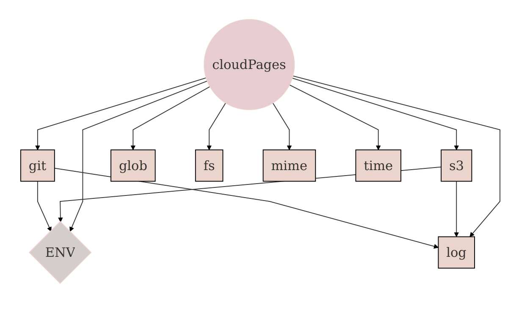

<!--
# This file is automatically generated by the `jsarch`
# module. Do not change it elsewhere, changes would
# be overriden.
-->
# Architecture Notes

## The `cloudPages` Service

The `cloudPages` service allows to deploy a new frontend version
 to the cloud by managing the number of prior versions to keep
 so that you won't have to manually check which version to keep
 and waste resources by forgoting to remove them.

This service needs some other services. To be able to mock and
 interchange them, we use
 [Knifecycle](https://github.com/nfroidure/knifecycle) for its
 dependency injection and inversion of control feature.

[See in context](./src/cloudpages.js#L26-L39)

### The `last` Option

The `last` option indicates how many versions should be
 kept in the cloud in order to smoothly change frontends
 avoiding users to face 404 errors if they still rely
 on an old frontend.

[See in context](./src/cloudpages.js#L6-L12)

### The `delay` Option

You can also specify a `delay` option indicating a delay
 for which versions should be kept anyway (in ms).

It default to a month and should be set to 0 to disable it.

[See in context](./src/cloudpages.js#L15-L21)

